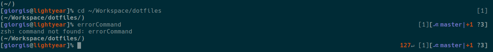

# Zsh Configg
Settings for the ZSH shell including promt and git support.

## Installation
`make install`

The install script will link the config files to your Home directory.

## Installation
`make uninstall`

The uninstall script will remove any linked files that were created from the install script.

## Prompt


The prompt uses the structure:
```
(Path)
[username@host]%
```

The right side uses the structure:
```
errorCode↵[RunningJobs][GitPrompt]
```

For more information you can read the documentation about [Prompt Expansion](http://zsh.sourceforge.net/Doc/Release/Prompt-Expansion.html).

## Git Prompt

### Usage
To update the git prompt change the Variables in the `.git.zsh`:

```
ZSH_THEME_GIT_PROMPT_PREFIX="%B[%%b"
ZSH_THEME_GIT_PROMPT_SUFFIX="%B]%%b"
ZSH_THEME_GIT_PROMPT_SEPARATOR="%B|%%b"
ZSH_THEME_GIT_PROMPT_BRANCH="%{$fg_bold[magenta]%}⎇ "
ZSH_THEME_GIT_PROMPT_ACTION="%{$fg_bold[blue]%}(%a)%{$reset_color%}"
ZSH_THEME_GIT_PROMPT_BEHIND="%{$reset_color%}↓"
ZSH_THEME_GIT_PROMPT_AHEAD="%{$reset_color%}↑"
ZSH_THEME_GIT_PROMPT_STAGED="%{$fg_bold[green]%}▴"
ZSH_THEME_GIT_PROMPT_UNSTAGED="%{$fg_bold[red]%}+"
ZSH_THEME_GIT_PROMPT_UNTRACKED="%{$fg_bold[cyan]%}?"
ZSH_THEME_GIT_PROMPT_CLEAN="%{$fg_bold[green]%}✓%{$reset_color%}"
```

To add it to the prompt add the following to the `.zshrc` file:

```
precmd () {
    ...
    vcs_info
	RPROMPT="...${vcs_info_msg_0_}"
    ...
}
```

The git prompt is using the `vcs_info` module of ZSH. For more information about the [vcs_info module](http://zsh.sourceforge.net/Doc/Release/User-Contributions.html#Version-Control-Information) and some [helpful examples](https://github.com/zsh-users/zsh/blob/master/Misc/vcs_info-examples).
